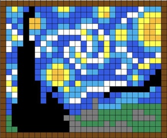

# Project Ideas

In this file (but not restricted to), you can use to get used to working on this repository and jot down project ideas to easily be shared with your mentors and to keep the history of!

1) Playlist Generator - React and Node.js to build a custom API

Input two or three of your favorite songs and app will generate you a customized play list of 5-20 songs.

API - https://openwhyd.github.io/openwhyd/API

Challenges: Criteria for song generator

2) Art program that allows you to mix colors and fill in pixels with them game. It'll have a game mode where players can try to best copy a piece of artwork 

API - https://metmuseum.github.io/

Challenges: Algorithm for color mixing

3) Ispy game - ten rounds of ispy. Game will generate image with ten hidden items and there will be a timer in it as well.

API - https://platform.openai.com/docs/guides/images or https://www.dall-efree.com/

Challenges: Creating games that have difficulty settings.
