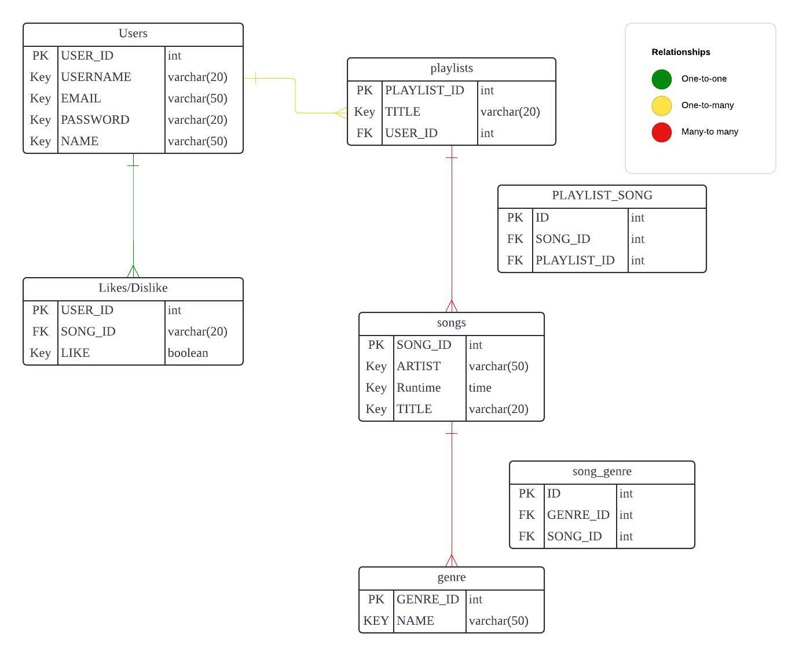

# Project Proposal: Violet

## Summary

This app creates play lists based on your preferences. Working in tandem with YouTube, it'll create music based on current selections, likes and dislikes, and hopefully introduce users to new music that they'll enjoy 

| Tech Stack  | Frontend: React, Bootstrap | Backend: Node.js
                                                                                                                                                                                                                                                                                                               
| Type        | This will be a web application however future project could to rebuild it as mobile app using React Native                                                                                                                                                                                                                                                                                                 

| Goal        | Creating a user friendly website that will generate and customize play lists, that they can export into YouTube. Ultimately it will allow users to play their play lists on the go.                                                                                                                                                                                                                                                                                                    

| Users       | Users of all ages but especially marketed to people that travel a lot and for long periods of time.                                                                                                                                                                                                                                                         

| Data        | ElephantSQL for the database users / songs / playlists and API - https://openwhyd.github.io/openwhyd/API. There might be some challenges for ElephantSQl, so I might create the API myself for the database

## Breakdown

When planning your project, break down your project into smaller tasks, knowing that you may not know everything in advance and that these details might change later. Some common tasks might include:

### Functionality
 - User login / authentication
 - Users song likes / dislikes
 - Auto generate playlists based on user preference
 - Export lists to youtube

### Tasks

 - Create backend using NODE.js
	 - GET / POST / DELETE USER_ID
	 - GET / POST / DELETE PLAYLIST_ID
	 - GET / POST / DELETE LIKES
	 - GET SONG_ID - songs can't be delted
	 - set up axios call to Song repository API
	 
 - Create frontend using React
	 - User component
	 - playlist component
	 - song component
	 - Navbar
	 - export to youtube function

## Stretch Goals  

Creating an accurate and self correcting algorithm that users can help refine with likes and dislikes.                                                                                                                                                                                                           